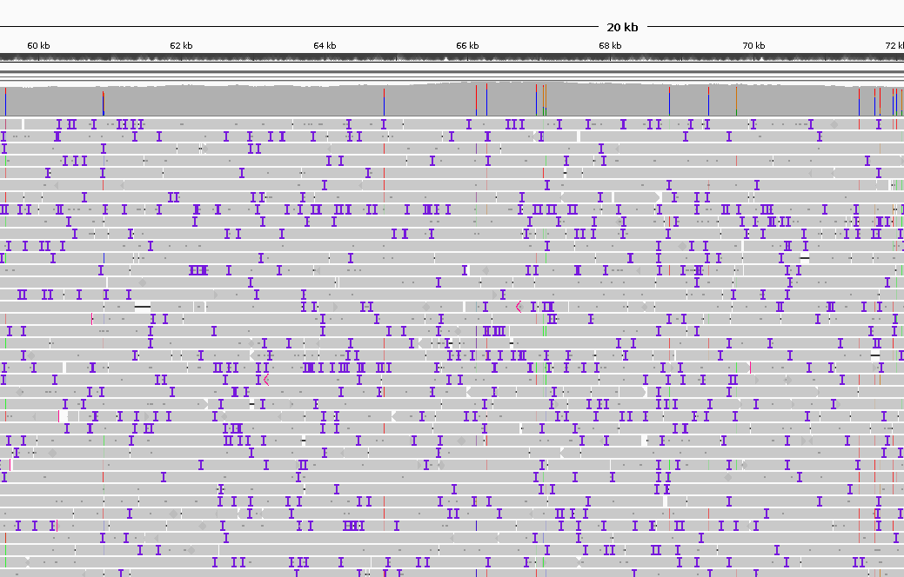

# exploring alignments with IGV

Parsing the sam file can be complicated. There are however convenient tools to visually inspect the aligned reads, such as [IGV](https://igv.org/).

## sorting and indexing mapped reads

As a first step to prepare the data for IGV, we need to
- convert the read aligment from `sam` to `bam` format. The two format are equivalent but the latter is binarized, and thus smaller in size.
- sort the `bam` file, i.e. order the mappings according to which comes first on the reference.
- index the `bam` file, i.e. create an auxiliary file that allows for quick access to the mappings.

```sh
# converting sam to bam file
samtools view -b map.sam > map.bam

# sorting bam file
samtools sort map.bam > map.sorted.bam

# indexing bam file (produces map.sorted.bam.bai)
samtools index map.sorted.bam
```

## visualizing alignments with IGV

To visualize the alignments, open IGV and:
- load the reads by selecting: File -> Load from File -> `map.sorted.bam`
- load the reference genome: Genomes -> Load Genome from file -> `bas54.fa`

You can navigate the genome and zoom in/out to inspect the alignments.



Each line is a different read alignment. You can occasionally see reads starting / ending.
The first few things to notice is that we see many small insertions (purple) or deletions (blank gaps) in the reads. This is a common artifact of Nanopore sequencing technology.

## let's explore more!

- why is there a peak in the coverage pattern?
- Are there sites where many alignments begin/end?
- where are most supplementary alignments?
- some regions have higher number of mismatches, e.g. position 71'493. What could be the reason?
- why are there so many gaps around position 82'045?
- occasionally you find isolated clipped reads in the middle of the genome. These often have a supplementary alignment that starts at the clipped position but goes backward. Why can that be?
___

$\leftarrow$ [previous part](note2.md)